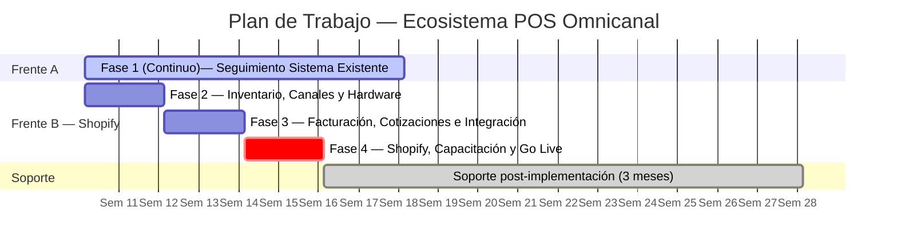

# Integración POS Omnicanal

## Kitchen Valenzuela — Ecosistema POS Omnicanal

**Folio:** D-002
**Fecha:** 10 de marzo de 2026

**Proyecto:** Ecosistema POS Omnicanal
**Cliente:** Kitchen Valenzuela
**Contactos:** Aisha · Rubén Valenzuela
**Proveedor:** Klef Agency

---

## 1. Introducción

Actualmente se requiere integrar un ecosistema de operación omnicanal que unifique su punto de venta físico, su canal de ventas en línea y su proceso de facturación electrónica bajo una sola plataforma. El sistema debe operar con **inventario centralizado** como fuente única de verdad y debe permitir:

* La generación de cotizaciones formales
* Gestionar pedidos mediante panel de administración
* Emitir **CFDI 4.0** de forma fluida o automática
* Etiquetado de productos
* Hardware de escaneo
* Integración con sistemas externos
* Integración con canales en línea como página web y Shopify
* Conexión con Tablet o POS

El proyecto contempla **dos frentes de trabajo en paralelo** durante su primera etapa:

**Frente A — Seguimiento al sistema existente:**
El negocio actualmente cuenta con un desarrollo en curso en kitchencleanvalenzuela.net. La primera prioridad será dar seguimiento activo y presión al equipo de desarrolladores responsables para que concluyan la entrega del servicio contratado, y validar que la plataforma funcione en todo su alcance antes de proceder con integraciones.

**Frente B — Implementación Shopify (en paralelo):**
Mientras se resuelve la liberación del sistema existente, se avanzará con la configuración de Shopify como plataforma de inventario, POS y ventas en línea. Una vez que el sistema de kitchencleanvalenzuela.net esté liberado y validado, ambas plataformas se conectarán para operar de forma integrada.

Al concluir el proyecto, se brindarán **3 meses de soporte** sobre el ecosistema implementado para garantizar la estabilidad operativa y acompañar al equipo en la adopción del sistema.

---

## 2. Objetivos

**1. Gestión del sistema existente e inventario centralizado**
Dar seguimiento al equipo de desarrollo de kitchencleanvalenzuela.net hasta obtener la entrega completa y validada, asegurando que el inventario opere como una sola fuente de verdad que refleje el stock disponible en todos los canales en tiempo real.

**2. Sincronización automática**
Cualquier movimiento de inventario se propaga instantáneamente a todos los canales.

**3. Etiquetado de productos**
Imprimir etiquetas con código de barras para todos los productos del catálogo.

**4. Hardware integrado**
Operar el POS desde tablet con escáner y etiquetadora.

**5. Flujo de cotizaciones**
Generar cotizaciones formales que al aceptarse se conviertan en pedidos y descuenten inventario de forma automática.

**6. Facturación CFDI 4.0**
Al confirmarse el pago de cualquier pedido, generar la factura electrónica automáticamente o enviar al cliente el enlace de autofactura.

**7. Integración de sistemas**
Conectar el sistema de kitchencleanvalenzuela.net con Shopify una vez liberado.

**8. Capacitación y adopción**
Que Aisha, Rubén y el equipo operen el sistema con autonomía al finalizar el proyecto.

---

## 3. Alcance del Proyecto

### Incluido

El proyecto se ejecuta en **5 fases** distribuidas en **12 semanas (3 meses)**:

**Fase 1 (Continuo) — Seguimiento Sistema kitchencleanvalenzuela.net** *(Semanas 1–8)*

* Establecimiento de canal de comunicación directo con el equipo de desarrollo.
* Reporte de brechas: qué está funcionando, qué falta, cuáles son los bloqueos y agilizar el proceso.
* Seguimiento semanal con reportes de avance, compartidos con Aisha y Rubén.
* Pruebas funcionales completas en staging y producción una vez entregado el sistema.
* Documentación de endpoints o métodos disponibles para la integración posterior.

**Fase 2 — Inventario, Canales y Hardware** *(Semanas 1–2)*

* Configuración de roles de usuario: Aisha, Rubén y personal de mostrador.
* Diseño de la estructura del catálogo: categorías, variantes, unidades.
* Carga del catálogo de productos con SKU, precio, descripción, stock inicial y fotos, con ayuda de Dulce.
* Configuración de la ubicación de inventario.
* Pruebas de sincronización: web → POS, POS → web, ajuste manual → ambos canales.
* Conexión de etiquetadora Dymo e instalación de App Retail Barcode Labels.
* Diseño e impresión de etiquetas para todo el inventario inicial.
* Emparejamiento de escáner Bluetooth con iPad y pruebas en POS.
* Creación de cuenta Shopify, selección de plan (Basic). Opcional para este punto: conexión de dominio. Se dara de alta como adelanto y respaldo del frente A.

**Fase 3 — Facturación, Cotizaciones e Integración** *(Semanas 3–4)*

* Definición de estructura de impuestos (IVA 16%) y formas de pago.
* Configuración de Draft Orders (Cotizaciones) con campos fiscales del cliente (RFC, razón social, uso CFDI).
* Prueba completa del ciclo: cotización → aprobación → pedido → pago → CFDI timbrado.
* Integración con kitchencleanvalenzuela.net si ya fue liberado en esta fase.
* Si el portal no está liberado: documentar la integración pendiente y dejar los accesos preparados.
* Instalación de App Facturama en Shopify y conexión con credenciales existentes.
* Instalación y configuración de la App Shopify POS en el iPad.

**Fase 4 — Shopify, Capacitación y Go Live** *(Semanas 5–6)*

* Sesión de capacitación con Aisha, Rubén, Dulce y personal operativo (flujo de venta, cotizaciones, inventario, reportes).
* Definición de procedimientos de apertura y cierre de caja.
* Prueba integral end-to-end: escaneo → cobro → CFDI, sin asistencia técnica.
* **Go Live oficial:** primer día de operación real en todos los canales.

**Soporte post-implementación — 3 meses incluidos** *(Mes 2–4)*

* Resolución de incidencias en Shopify, Facturama y la integración de sistemas.
* Ajustes de configuración que surjan durante la operación real.
* Canal de soporte vía WhatsApp Business con tiempo de respuesta de 7:00 hrs a 20:00 hrs en días hábiles.
* Reunión quincenal de seguimiento (30 min por videollamada).
* Reporte mensual del estado del ecosistema.

---

## 4. Servicios

### Frente A (Continuo): Seguimiento de Sistema Existente

**Precio:** Incluido en el proyecto
**Descripción:** Gestión activa del proceso de entrega del equipo de desarrollo externo de kitchencleanvalenzuela.net, generación de reportes de avance, establecimiento de criterios de aceptación y validación técnica previa a la integración.

---

### Fase 2: Inventario, Canales y Hardware

**Precio:** Incluido
**Descripción:** Creación y configuración inicial de cuenta Shopify, estructura y carga del catálogo de productos, configuración de inventario centralizado, activación de tienda online y POS, pruebas de sincronización omnicanal, e instalación y configuración de hardware (escáner, etiquetadora, tablet).

---

### Fase 3: Facturación, Cotizaciones e Integración

**Precio:** Incluido
**Descripción:** Automatización de CFDI 4.0, configuración de Draft Orders como flujo de cotizaciones, y conexión del sistema kitchencleanvalenzuela.net con Shopify (condicionada a liberación del sistema externo).

---

### Fase 4: Shopify, Capacitación y Go Live

**Precio:** Incluido
**Descripción:** Capacitación integral del equipo operativo (flujo de venta, cotizaciones, inventario y reportes), prueba end-to-end del ecosistema completo y lanzamiento oficial de operaciones en todos los canales.

---

## 5. Inversión

| Concepto | Detalle | Subtotal |
| --------------------------------------------------- | ----------------------------- | --------------- |
| **Honorarios Klef Agency — Proyecto completo** | Fases 0 a 4 + 3 meses soporte | $24,500 MXN |
| **TOTAL** | | **$24,500 MXN** |

### Plan de Pagos

| # | Pago | Monto | Hito que lo activa |
| - | ----------------- | ---------- | --------------------------------------------------------- |
| 1 | Arranque | $6,125 MXN | Firma de propuesta e inicio del proyecto |
| 2 | Fase 1 + 2 | $6,125 MXN | Shopify activo, catálogo cargado, canales sincronizados |
| 3 | Fase 3 | $6,125 MXN | CFDI automático funcionando y cotizaciones operativas |
| 4 | Go Live + Soporte | $6,125 MXN | Hardware instalado, equipo capacitado y operación en vivo |

---

## Notas

* Precios expresados en pesos mexicanos. El IVA (16%) se desglosará al momento de la facturación según régimen fiscal.
* Vigencia de la cotización: **15 días naturales** a partir de la fecha de emisión.
* **Hardware recomendado:** estimado entre $758 y $1,498 USD.
* **Plataformas recurrentes:** Shopify Basic ~$19 USD/mes.

---

## Garantías

* 3 meses de soporte técnico y operativo incluidos tras el Go Live.
* Acompañamiento continuo durante la operación inicial para garantizar estabilidad.

---

## Condiciones de Integración con Sistema Externo

La integración con el sistema **kitchencleanvalenzuela.net** queda condicionada a la disponibilidad técnica y operativa del mismo. Para proceder con la integración, deberán cumplirse las siguientes condiciones mínimas:

1. Disponibilidad del personal técnico, del sistema y su infraestructura.
2. Documentación funcional o técnica de endpoints, APIs o métodos de integración de la plataforma.
3. Estabilidad operativa del sistema en ambiente productivo.
4. Acceso a credenciales necesarias como administrador y, de ser posible, a un ambiente de pruebas del sistema (staging).

En caso de que alguna de estas condiciones no se cumpla dentro de los tiempos del proyecto, la integración podrá ser reprogramada sin que esto afecte la continuidad operativa del ecosistema basado en Shopify ni represente incumplimiento por parte de Klef Agency.

---

## Responsabilidad sobre Hardware

La adquisición, instalación física, adecuación eléctrica, conectividad de red, configuración de internet y mantenimiento preventivo o correctivo del hardware requerido para la operación del sistema (incluyendo tablet, escáner, etiquetadora, impresora u otros dispositivos) es responsabilidad directa del cliente.

Esto incluye, de manera enunciativa pero no limitativa:

* Compra o reposición de equipos
* Disponibilidad de red WiFi o cableada estable
* Configuración de routers, módems o infraestructura de red local
* Mantenimiento físico del equipo
* Garantías con fabricantes o proveedores
* Sustitución de equipos defectuosos
* Disponibilidad de suministro eléctrico estable
* Uso de reguladores, supresores de voltaje o sistemas de respaldo (UPS) cuando sea necesario

El cliente es responsable de mantener activas las licencias, suscripciones y credenciales de acceso a plataformas externas necesarias para la operación del sistema, incluyendo pero no limitado a servicios de comercio electrónico, facturación electrónica, dominios, hosting o aplicaciones de terceros.

Klef Agency realizará únicamente las actividades relacionadas con la integración lógica del hardware al sistema, incluyendo:

* Configuración del hardware dentro del software POS o plataforma correspondiente
* Verificación de compatibilidad y funcionamiento con el sistema
* Pruebas operativas básicas para validar el flujo de trabajo
* Asistencia remota para validar la correcta comunicación entre el sistema y los dispositivos

La asistencia remota se limita a la validación de configuración y funcionamiento del sistema. No incluye soporte continuo, monitoreo permanente ni administración de infraestructura de red o hardware.

La responsabilidad de Klef Agency no abarca:

* Fallas físicas o errores de fábrica del hardware
* Fallas de conectividad a internet o red local
* Daños derivados de uso inadecuado o desgaste natural del equipo
* Garantías, reparaciones o reemplazo de dispositivos
* Soporte técnico especializado sobre infraestructura, cableado o redes
* Interrupciones derivadas de fallas eléctricas, variaciones de voltaje o apagones

Cualquier modificación en la infraestructura de red, energía o hardware posterior a la implementación podrá requerir una nueva configuración o servicio adicional, el cual será cotizado por separado.

---

## Condiciones Operativas Mínimas

El correcto funcionamiento del sistema depende de la disponibilidad de infraestructura adecuada por parte del cliente, incluyendo suministro eléctrico estable, conectividad a internet, equipos compatibles y mantenimiento físico del hardware.

En caso de no cumplirse dichas condiciones, la operación del sistema puede verse afectada sin que ello constituya una falla del software implementado.

Cualquier interrupción derivada de fallas eléctricas, conectividad, infraestructura o hardware no será considerada una falla del sistema implementado.

---

## Alcance del Soporte Técnico

El servicio de soporte incluido durante el periodo post-implementación contempla actividades relacionadas con la operación y configuración del sistema implementado.

**El soporte incluye:**

* Configuración del sistema y ajustes operativos
* Atención a incidencias relacionadas con el funcionamiento del POS, inventario y facturación
* Ajustes menores derivados del uso cotidiano del sistema
* Orientación operativa sobre procesos previamente implementados

**El soporte no incluye:**

* Desarrollo de nuevas funcionalidades
* Cambios estructurales en la arquitectura del sistema
* Integraciones adicionales a las contempladas en este proyecto
* Soporte técnico sobre hardware o infraestructura física
* Sesiones adicionales de capacitación fuera de las contempladas en el alcance inicial
